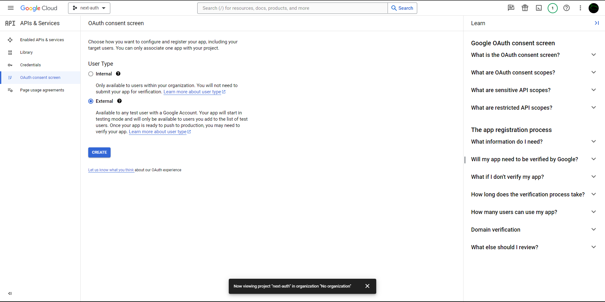
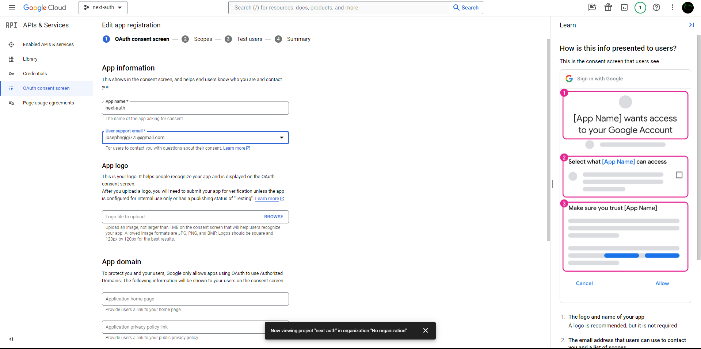
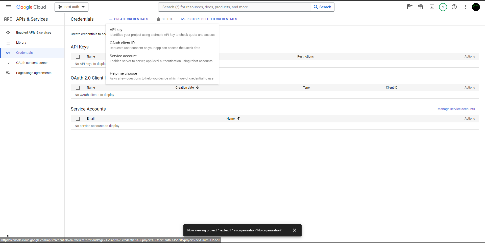
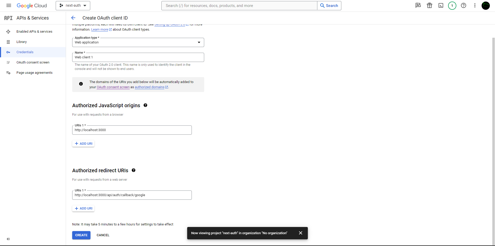
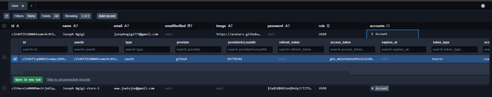
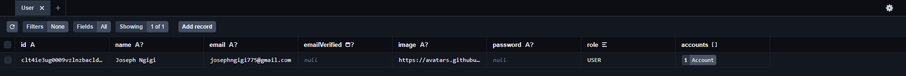
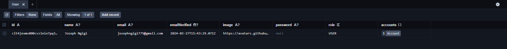

# Getting Started with Next Auth

This is a [Next.js](https://nextjs.org/) project bootstrapped with [`create-next-app`](https://github.com/vercel/next.js/tree/canary/packages/create-next-app). Normally I use the Next.js Canary channel; which I initialize using:

```bash
npm install next@canary
```

First, run the development server:

```bash
npm run dev
# or
yarn dev
# or
pnpm dev
# or
bun dev
```

## `Bcrypt`

`Bcrypt` is used to hash the passwords used in the project. We install it using `npm install bcrypt` and `npm install -D @types/bcrypt`

## zod

zod is a TypeScript-first schema declaration and validation library. It allows you to define schemas for your data and validate that data against those schemas. This below shows how we can define schemas:

```TS
import { z } from 'zod';

const userSchema = z.object({
  username: z.string().min(3),
  email: z.string().email(),
  age: z.number().min(18),
});

```

This one below is a next.js API route where zod is used to validate data when it is received.

```TS
import { NextApiRequest, NextApiResponse } from 'next';
import { z } from 'zod';

const userSchema = z.object({
  username: z.string().min(3),
  email: z.string().email(),
  age: z.number().min(18),
});

export default function handler(req: NextApiRequest, res: NextApiResponse) {
  try {
    const data = userSchema.parse(req.body);
    res.status(200).json({ message: 'Data is valid!', data });
  } catch (error) {
    res.status(400).json({ message: 'Invalid data!', error: error.errors });
  }
}

```

the line `const data ` has `userSchema.parse()`, which is used to validate the incoming data against the defined schema. If the data is valid, it proceeds as expected. If not, it throws an error which can be caught to handle invalid data.

**How does zod work using React-Hook-Form** <br/>

The code snippet provided is using the `useForm` hook from a form library, likely React Hook Form, and it's integrated with zod for form validation.

```TS
  const form = useForm<zod.infer<typeof LoginSchema>>({
    resolver: zodResolver(LoginSchema),
    defaultValues: {
      email: '',
      password: '',
    }
  })

```

1. **`useForm` Hook**: This hook is the form library React Hook Form. It's used to manage form state and handle form submissions.

2. **`<zod.infer<typeof LoginSchema>>`**: This part is using TypeScript's `infer` keyword along with zod's types. `infer` is used to extract the type from a zod schema. So, `zod.infer<typeof LoginSchema>` extracts the type of data that conforms to the `LoginSchema`.

3. **`resolver: zodResolver(LoginSchema)`**: This line configures the resolver for the form. The `zodResolver` function is provided by a library that integrates zod with form validation. It takes the `LoginSchema` as an argument and generates a resolver for the form that uses zod for validation.

4. **`defaultValues`**: This specifies the default values for the form fields. In this case, it sets the initial values for the email and password fields to empty strings.

The `LoginSchema` defines the shape and validation rules for the form data, and the form is configured to use this schema for validation via the `resolver` option. The `defaultValues` object provides initial values for the form fields.

**How zod works on bare JSX**

If you're working with bare-metal JSX without libraries like React Hook Form, you can still use zod for client-side data validation. You'll need to handle the form submission and validation logic manually. Here's a basic example of how you can achieve this:

```TS
import { useState } from 'react';
import { z } from 'zod';

// Define your schema
const userSchema = z.object({
  username: z.string().min(3),
  email: z.string().email(),
  age: z.number().int().min(18),
});

function MyForm() {
  // State to hold form data and errors
  const [formData, setFormData] = useState({
    username: '',
    email: '',
    age: '',
  });
  const [errors, setErrors] = useState({});

  // Handle form input change
  const handleInputChange = (e) => {
    const { name, value } = e.target;
    setFormData({ ...formData, [name]: value });
  };

  // Handle form submission
  const handleSubmit = (e) => {
    e.preventDefault();

    // Validate the form data against the schema
    try {
      userSchema.parse(formData);
      // Data is valid, proceed with form submission
      console.log('Form submitted with data:', formData);
      // Reset form and errors
      setFormData({ username: '', email: '', age: '' });
      setErrors({});
    } catch (error) {
      // Data is invalid, set validation errors
      console.error('Validation error:', error.errors);
      setErrors(error.formErrors.fieldErrors);
    }
  };

  return (
    <form onSubmit={handleSubmit}>
      <div>
        <label>Username:</label>
        <input
          type="text"
          name="username"
          value={formData.username}
          onChange={handleInputChange}
        />
        {errors.username && <span>{errors.username.message}</span>}
      </div>
      <div>
        <label>Email:</label>
        <input
          type="email"
          name="email"
          value={formData.email}
          onChange={handleInputChange}
        />
        {errors.email && <span>{errors.email.message}</span>}
      </div>
      <div>
        <label>Age:</label>
        <input
          type="number"
          name="age"
          value={formData.age}
          onChange={handleInputChange}
        />
        {errors.age && <span>{errors.age.message}</span>}
      </div>
      <button type="submit">Submit</button>
    </form>
  );
}

export default MyForm;
```

In this example:

- We define a form component (`MyForm`) that manages form state using `useState`.
- On form submission, we validate the form data against the zod schema (`userSchema`). If validation fails, we catch the error and set the validation errors state. If validation succeeds, we proceed with form submission.
- Validation errors are displayed below each form field.
- The form is reset after successful submission.

This approach demonstrates how you can use zod for client-side data validation in a bare-metal JSX environment without relying on additional form libraries like React Hook Form.

## React Hook Form

If you want to use React Hook Form without using zod as a resolver for validation, you can still define your validation logic separately and integrate it with React Hook Form. Here's a basic example of how you can achieve this:

```TSX
import React from 'react';
import { useForm } from 'react-hook-form';

// Define your validation rules separately
const validateEmail = (value) => {
  // Basic email validation logic
  if (!value) return 'Email is required';
  if (!/\S+@\S+\.\S+/.test(value)) return 'Invalid email address';
  return undefined; // Return undefined if validation passes
};

const validatePassword = (value) => {
  // Basic password validation logic
  if (!value) return 'Password is required';
  if (value.length < 6) return 'Password must be at least 6 characters';
  return undefined; // Return undefined if validation passes
};

function MyForm() {
  const { register, handleSubmit, errors } = useForm();

  const onSubmit = (data) => {
    console.log(data);
  };

  return (
    <form onSubmit={handleSubmit(onSubmit)}>
      <div>
        <label>Email:</label>
        <input type="text" name="email" ref={register({ validate: validateEmail })} />
        {errors.email && <span>{errors.email.message}</span>}
      </div>
      <div>
        <label>Password:</label>
        <input type="password" name="password" ref={register({ validate: validatePassword })} />
        {errors.password && <span>{errors.password.message}</span>}
      </div>
      <button type="submit">Submit</button>
    </form>
  );
}

export default MyForm;

```

In this state, you can note that we have the `useForm` destructured to provide a set of functions. The set of functions can be used in the native `html/jsx form`.

The `useForm` hook from React Hook Form provides a set of functions and methods that you can use to manage form state, handle form submissions, and integrate validation logic. Here's a brief overview of some key functions provided by `useForm`:

1. **register**: This function is used to register input elements with the form. It collects input values when the form is submitted.

2. **handleSubmit**: This function is used to handle form submissions. It takes a callback function as an argument, which is executed when the form is submitted.

3. **errors**: This object contains validation errors for the form inputs. Each key corresponds to the name of an input field, and the value is the error message.

4. **watch**: This function is used to watch for changes to specific form inputs. It returns the current value of the watched input.

5. **reset**: This function is used to reset the form to its initial state, including resetting input values and clearing validation errors.

6. **formState**: This object contains the current state of the form, including whether it's dirty, valid, submitting, etc.

7. **getValues**: This function is used to get the current values of all registered inputs in the form.

8. **setValue**: This function is used to programmatically set the value of a form input.

These are some main functions provided by `useForm`, but there are others as well. You can use these functions to build complex forms and handle form interactions in your React applications.

# Getting Started With Server Actions

On this project, I have utilized the server actions. This is the same as using the API's routes, but it is more simple to utilize when making database requests. Here is an example of a **server action** code. The return values work the same as having a `NextResponse` in the APIs.

```TS
"use server"

export const loginAction = async (values: any) => {

    const validatedFieldValues = LoginSchema.safeParse(values)

    if (!validatedFieldValues) {
        return { error: "Invalid fields" }
    }

    console.log("validatedFieldValues", validatedFieldValues);
    return { success: "Email Sent" }


}
```

## PRISMA ORM

An ORM, or Object-Relational Mapping, is a programming technique that enables developers to work with relational databases using an object-oriented approach. It essentially maps database tables to classes in object-oriented programming languages, and rows in those tables to objects in the programming language. Here's why you might use an ORM and in which scenarios:

1. **Abstraction of Database Complexity**: ORMs abstract away much of the complexity of working directly with relational databases, providing a more intuitive and object-oriented interface for developers. This can greatly simplify database interactions and reduce the amount of SQL code that developers need to write.

2. **Improved Productivity**: ORMs can boost developer productivity by automating many common database tasks, such as CRUD operations (Create, Read, Update, Delete), query generation, and object serialization/deserialization. This allows developers to focus more on application logic rather than low-level database interactions.

3. **Platform Independence**: ORMs often provide a level of platform independence, allowing developers to write database-agnostic code that can easily switch between different database systems (e.g., MySQL, PostgreSQL, SQLite, etc.) without major code changes.

4. **Type Safety**: Some ORMs, like Prisma, provide type safety by generating types based on the database schema. This can help catch potential errors at compile time and improve code quality.

5. **Reduced SQL Injection Vulnerabilities**: ORMs typically use parameterized queries or prepared statements internally, which helps mitigate the risk of SQL injection attacks by separating SQL code from data values.

Scenarios where you might consider using an ORM include:

- **Rapid Application Development**: ORMs can be particularly useful in scenarios where speed of development is crucial, such as prototyping or building minimum viable products (MVPs).
- **Complex Data Models**: When dealing with complex data models or relationships between multiple tables, ORMs can simplify the process of fetching and manipulating data.

- **Multi-Database Support**: If your application needs to support multiple database systems, an ORM can abstract away the differences between them, making it easier to switch between databases or support multiple databases simultaneously.

- **Team Collaboration**: ORMs can facilitate collaboration among team members, as they provide a common abstraction layer that all developers can work with, regardless of their level of expertise with SQL or the specific database system being used.

However, it's worth noting that while ORMs offer many benefits, they may not be suitable for all scenarios. In some cases, especially when dealing with complex database queries or performance-critical applications, writing custom SQL queries may be more appropriate. Additionally, there can be a learning curve associated with using ORMs effectively, and they may introduce some overhead in terms of performance or flexibility compared to raw SQL.

## Prisma Initialization

```TS
/**
 * We @initialize @param globalThis in development because of hot reloading. If we don't do that, it will always initialize a new @function PrismaClient
 * everytime it reloads that we have too may active prisma clients.
 * In production, we always initialize it like this:
 * @param export const @var db = new @function PrismaClient()
 */
```

Having too many active Prisma clients can lead to several potential issues:

1. **Resource Consumption**: Each active Prisma client consumes system resources, including memory and potentially CPU cycles. If many clients are created and kept active unnecessarily, it can lead to excessive resource consumption, potentially impacting the performance and stability of the application and the host system.

2. **Connection Pool Exhaustion**: Prisma clients typically use connection pooling to manage database connections efficiently. Each client maintains a pool of database connections that it can reuse to execute queries. If too many clients are created, it can lead to connection pool exhaustion, where there are not enough available connections to serve incoming requests. This can result in connection timeouts, errors, or degraded performance.

3. **Database Load**: Each active Prisma client may result in one or more connections to the underlying database server. If there are too many active clients, it can increase the load on the database server, potentially leading to performance degradation or even server overload.

4. **Concurrency Issues**: Depending on the database system and configuration, excessive concurrent connections from multiple clients may lead to contention and concurrency issues, such as locking or blocking. This can impact the scalability and responsiveness of the application.

5. **Cost**: In cloud environments or situations where resources are metered or billed based on usage, having too many active clients may result in higher costs due to increased resource consumption.

While having multiple active Prisma clients may not inherently be problematic, excessive client creation and retention can lead to various issues related to resource consumption, performance, scalability, and cost. Therefore, it's generally advisable to manage the number of active clients efficiently to ensure optimal performance and resource utilization.

---

**Prisma Installation**<br/>

After installation of prisma using `npm install prisma` and `npm install prisma/client`, we run `npx prisma init` which will add a _**prisma folder**_ and an _**env file**_

Take note of:<br/>

```bash

npm i --save-dev prisma@latest                       │
npm i @prisma/client@latest

```

After that we go to the database. In this case I am using the neon database, where I will create the database. Remember to choose the prisma ORM and then copy the connection setup and the environment variables.

After we have initialized everything, now we go to our Prisma ORM folder where we have initialized our database and add our first model (This is like the table in the database). We will initialize the model so that we can use it globally using the db client we had initialized earlier.

```bash
npx prisma generate
npx prisma db push
```

On this front, we have already managed to connect to the database and pushed our models. The only thing remaining is for us to be able to send the data to the database. As we have already started with the code on server actions.

On this we see how we can write a `server action function`, where we receive the userInput values from the front end part. The data us then verified using `zod`

```TS
export const registerAction = async (userInputValues: <zod.infer<typeof RegisterSchema>>) =>{

}
```

This part is inside the server action function where we can now validate the data received from the frontend by calling the given function. In the frontend, we are using the `useTransition()` react function. We can also do a self verification. The data is further passed in a type safe zod schema object, where it verifies the types are correct

```TS
const validateInputData = RegisterSchema.ParseSafe(userInputVales)
if (!validateRegisterValues) {
  return { error: "Please check your input details" };
}
```

On this section, we have to now destructure the data that is received after the typesafe check. It has `data` and `success` inside. We need the data part, which is further destructured to have the individual data, so we can send it to the database. Also, here we can also now hash the password as shown.

```TS
if (!validateRegisterValues.success) {
        // Safe to destructure here
        return { error: "Check you details" };
    }

    const { email, password, name } = validateRegisterValues.data;

    const hashedPassword = await hash(password, 10)

    const existing_user = await getUserByEmail(email);
    if (existing_user) {
        return {info: "User Already exists"}
    }
```

This section now creates an entity in the database using the destructured data.

```TS
 await data_base.user.create({
    data: {
      email,
      name,
      password: hashedPassword
    }
  })
```

# Auth Version 5

> "We worked hard to avoid having to save your config options in a separate file and then pass them around as `authOptions` throughout your application. To achieve this, we settled on moving the configuration file to the root of the repository and having it export an auth function you can use everywhere else."

I have already covered `Auth V4`. But I wanna now work with `Auth version 5`. This one has some changes like, it has moved the `authOptions` in the root folder. We still have the API route in this manner.

`app/api/auth/[...nextauth]/route.ts`

```TS

export { GET, POST } from "./auth"
export const runtime = "edge" // optional
```

- `app/api/auth/`: This directory houses API routes related to authentication, including NextAuth.js.
- `[...nextauth]`: This dynamic segment captures all paths within the auth directory, allowing NextAuth.js to handle requests to various authentication endpoints.
- `route.ts`: This file contains the NextAuth.js configuration, specifying providers, callbacks, and other options. In the new version, it contains only the routes `GET` and `POST`.

We now set up the `auth` file which has been moved to the route folder. The `./auth` file contains now the handlers and the providers

```TS
import NextAuth from "next-auth";
import GitHub from "next-auth/providers/github";

export const {
  handlers: { GET, POST },
  auth,
} = NextAuth({
  providers: [GitHub],
});
```

Next is to set up the middleware. Middleware is `NextJS` specific and not `NextAuth`.

```TS
import { auth } from "./auth"

export default auth((req) => {
  // req.auth
})

// Optionally, don't invoke Middleware on some paths
export const config = {
  matcher: ["/((?!.+\\.[\\w]+$|_next).*)", "/", "/(api|trpc)(.*)"],
}
```

`matcher` is used to invoke the middleware; that is it will invoke the auth function. This is contrary to what developers say that is used to protect routes; that is protected private routes. Now I have changed the matcher regular expression. The regular expression is so that the middleware can be invoked in every page, except the ones specified in the regular expression.

This is used in the Clerk Middleware, which is better according to Antonio from [Code With Antonio](https://www.codewithantonio.com/)

`matcher: ["/((?!.+\\.[\\w]+$|_next).*)", "/", "/(api|trpc)(.*)"],`

This one is used in the `nextJS` middleware.

`matcher: ["/((?!api|_next/static|_next/image|favicon.ico).*)"],`

**What is Middleware in `NEXTJS`?**

Middleware refers to a function that runs before handling a request. It is commonly used for tasks such as authentication, logging, modifying request/response objects, and error handling. Middleware intercepts incoming requests, performs some action, and then passes the request along to the next middleware function in the stack or to the route handler.

In the context of Next.js, middleware is often used with API routes. Middleware functions can be added to API routes using the middleware property in the handler function. These middleware functions execute sequentially, allowing you to modify the request or response as needed before the API route's main logic executes.

### Edge Runtime

This refers to the environment in which code executes at the edge of a network, closer to users. This means the code runs on servers located geographically closer to users, reducing latency and improving performance. Edge runtimes can be used for various purposes, including:

- Delivering content quickly and efficiently (e.g., CDN edge caching).
- Processing data in real-time (e.g., IoT applications).
- Offloading tasks from central servers (e.g., edge functions).

Some frameworks and platforms have specific implementations of "edge runtime" with their own features and limitations. Here are two examples:

- **Vercel Edge Runtime:** This is a lightweight runtime designed for server-side functions running on Vercel's edge network. It offers limited APIs but provides fast execution and low resource usage.
- **Next.js Edge Runtime:** This is a subset of the Node.js runtime available in Next.js. It's designed for rendering dynamic content at low latency and offers a limited set of Node.js APIs.

`TLDR`: Remember edge is an environment.

ORMS, by now in 2024 February, like Prisma does not work on edge. which means we are will not be able to use a lot of callbacks and events in the `auth.ts` file. To go around this, we need to separate the auth config, and use the config in the middleware. What do I mean by this?

_We were importing the `auth.ts` file that contains the route handler for authentication from the route folder, into the middleware. Since the prisma adapter does not work on the edge runtime, whereas the middleware works on the **edge runtime**_

`import { auth } from "./auth"`

That means that we will use the file `auth.config.ts` to trigger the middleware and not the one we were using earlier; `auth.ts`. This is the `auth.ts` file

```TS
import NextAuth from "next-auth";

import authConfig from "@/auth.config";
import { PrismaAdapter } from "@auth/prisma-adapter";
import { data_base } from "@/src/lib/prisma-db";
console.log("AuthConfig: ", authConfig);

export const {
  handlers: { GET, POST },
  auth,
} = NextAuth({
  adapter: PrismaAdapter(data_base),
  ...authConfig,
});

```

In the documentation, they have the code a little different and this is because for this project that is not in production, I have the `prismaClient` in a different file, that is explained why it is like that. In the documentation they have the prisma client initialized in the config file

```TS
import NextAuth from "next-auth"
import { PrismaAdapter } from "@auth/prisma-adapter"
import { PrismaClient } from "@prisma/client"
import authConfig from "./auth.config"

const prisma = new PrismaClient()

export const { handlers, auth } = NextAuth({
  adapter: PrismaAdapter(prisma),
  session: { strategy: "jwt" },
  ...authConfig,
})
```

The `authConfig` file simply has an object that has the object of the auth providers. Which when we log it out in the `auth.ts` file it gives us this: `{ providers: [ [Function: GitHub] ] }`

```TS
import type { NextAuthConfig } from "next-auth";
import GitHub from "next-auth/providers/github";

export default {
  providers: [GitHub],
} satisfies NextAuthConfig;
```

### What role does `PrismaAdapter` play in all this?

The `PrismaAdapter` plays a crucial role in bridging your `NextAuth.js` authentication flow with the Prisma database. Here's a breakdown of its significance:

**What is NextAuth.js?**

NextAuth.js is a popular library for implementing user authentication in Next.js applications. It simplifies the process of handling user sign-in, sign-out, session management, and integration with various authentication providers.

**What is Prisma?**

Prisma is an object-relational mapper (ORM) that simplifies interacting with relational databases in Node.js and TypeScript applications. It allows you to define your database schema and access data using a more intuitive API.

**What does `PrismaAdapter` do?**

The `PrismaAdapter` from `@auth/prisma-adapter` acts as an adapter between NextAuth.js and Prisma. It translates the operations required by NextAuth.js (e.g., creating users, storing session data) into valid Prisma queries and operations. This eliminates the need for manual database interaction and ensures compatibility between your authentication flow and your database schema.

**Specifically, `PrismaAdapter` handles tasks like:**

- **User management:** Creating new users, fetching user information, updating user data.
- **Session management:** Storing and retrieving session data in your Prisma database.
- **OAuth's integration:** Linking OAuth accounts to user profiles in your database.
- **Customizations:** You can extend the adapter to handle specific needs or integrate with custom logic.

**In the code:**

- We are importing `PrismaAdapter` and providing the `data_base` instance from your `prisma-db` file.
- I then set the `adapter` option in the `NextAuth` configuration to use the `PrismaAdapter`.
- This allows NextAuth.js to seamlessly interact with your Prisma database for user and session management.

### Middleware Validation

In the code, the import from the routes, which contains strings of different routes in the project. This is necessary so, we can render the routes conditionally, so that, I can have protected routes according to the user sessions.

```TS
import {
  DEFAULT_LOGIN_REDIRECT,
  authAPIPrefix,
  authRoutes,
  publicRoutes,
} from "@/routes";

export default auth((req) => {
  const { nextUrl } = req;
  const isLoggedIn = !!req.auth;

  /**
   * This will return a boolean value based on::
   * The URL returned is compared against the pathname from the url is the same as the specified public routes
   *
   * @function {includes} Determines whether an array includes a certain element, returning true or false as appropriate.
   * @type { boolean }
   */
  const isPublicRoute: boolean = publicRoutes.includes(nextUrl.pathname);
  const isAPIAuthRoute: boolean = nextUrl.pathname.startsWith(authAPIPrefix);
  const isAuthRoute: boolean = authRoutes.includes(nextUrl.pathname)

});
```

```TS
const { nextUrl } = req;
const isLoggedIn = !!req.auth;
```

This will return a boolean value based on::The URL returned is compared against the `pathname` from the `url` is the same as the specified public routes

`@function {includes}`Determines whether an array includes a certain element, returning true or false as appropriate.
`@type { boolean }`

```TS
const isPublicRoute: boolean = publicRoutes.includes(nextUrl.pathname);
const isAPIAuthRoute = nextUrl.pathname.startsWith(authAPIPrefix);
const isAuthRoute: boolean = authRoutes.includes(nextUrl.pathname);``
```

What this is doing is that it is confirming whether the current `param URLS` API routes is prefixed by the `@path { "/api/auth"}`. If that is the case it goes on to return a null value. That is first allowed every single API route.

```TS
if (isAPIAuthRoute) {
  return null;
}
```

We then go check the auth routes. While technically they are public routes, we did not include them in the public routes. Otherwise, you are left in an infinite redirect loop. The auth routes include `@param {["/auth/login", "/auth/register"]}`
On this, when the `isAuthroute` is true, it means you are in either of the above routes. If false you are in another page. When I return null, it means it is true, hence it executes the code. Hence, it checks the `isLoggedIn`. If this is true, it redirects to the DEFAULT_LOGIN_REDIRECT page.

If the login is false, it will not redirect to that page, `@boolean { isLoggedIn }`. In the login, we return the Response, and from the response we get the redirect function, where we initialize a redirect URL we pass in the second argument, which in turn allows to create an absolute URL. like `@url {http://localhost:3000/auth/login}`

```TS
if (isAuthRoute) {
  if (isLoggedIn) {
    return Response.redirect(new URL(DEFAULT_LOGIN_REDIRECT, nextUrl));
  }
}
```

On providers, in `auth.config.ts`

```TS
import type { NextAuthConfig } from "next-auth";
import Credentials from "next-auth/providers/credentials";
import { compare } from "bcrypt";

import { LoginSchema } from "@/src/schemas";
import { getUserByEmail } from "./src/data/user_data";

export default {
  providers: [
    Credentials({
      // Start Custom Credentials Providers setup
      async authorize(credentials) {
        const validatedLoginData = LoginSchema.safeParse(credentials);

        if (validatedLoginData.success) {
          const { email, password } = validatedLoginData.data;

          /**
           * After we have validated the credentials we received from the custom user, we now have to check two things
           * if the user exists, through the email.
           *
           * Check whether the user signed up by other providers.
           * In this case, if the user signed up, and they don't have a password, they will use the provider.
           *
           * if none of this is true, then it returns a null value, prompting the user to signup
           */
          const user = await getUserByEmail(email);

          if (!user || !user.password) {
            return null;
          }

          const matchedPassword = await compare(password, user.password);

          if (matchedPassword) {
            return user;
          }
        }

        return null;
      },
      // End
    }),
  ],
} satisfies NextAuthConfig;

```

## The auth.ts file

**Here's a breakdown of the role of the `auth.ts` file in `NextAuth` v5 authentication:**

**1. Central Configuration:**

- Serves as the heart of authentication configuration for your Next.js application.
- Consolidates configuration options for providers, database adapters, session management, and authentication flows.

**2. Essential Imports:**

- **`NextAuth`:** Imports the core `NextAuth` library for authentication functionality.
- **`authConfig`:** Imports a separate configuration file (likely containing sensitive information) for enhanced organization and security.
- **`PrismaAdapter`:** Imports a custom database adapter (in this case, for Prisma) to interact with your chosen database.
- **data_base:** Imports a reference to your Prisma database client for adapter usage.

**3. `NextAuth` Instance Creation:**

- Creates a new `NextAuth` instance with these key configurations:
  - **adapter:** Specifies the `PrismaAdapter` to handle database interactions for user accounts.
  - **session:** Sets the session strategy to `"jwt"` for JSON Web Token-based authentication.
  - **`...authConfig`:** Spreads additional configuration options from the imported `authConfig` file for flexibility.

**4. Exported Functions and Handlers:**

- **handlers:** Exports the `GET` and `POST` handlers for authentication routes, essential for handling authentication attempts and responses.
- **`auth`:** Exports the `auth` object for accessing user session data and authentication state within your application components.
- **`signIn`:** Exports the `signIn` function to initiate the sign-in process for specified providers.
- **`signOut`:** Exports the `signOut` function to initiate user sign-out.

In essence, the `auth.ts` file acts as the command center for Setting up authentication providers and adapters, Configuring session management, Defining authentication flows and Providing essential functions for handling authentication interactions within your Next.js application.

## Session Strategy

A **session strategy** in `NextAuth` v5 defines how user authentication information is stored and managed during their interaction with your application. It essentially determines how `NextAuth` handles the state of a user being logged in or out.

Here are the **key aspects** of session strategies:

**1. Purpose:**

- Maintains user login state across different requests within a defined session duration.
- Enable features like remembering user choices, accessing user-specific data, and restricting unauthorized access.

**2. Choice of Strategy:**

- `NextAuth` offers multiple session strategies:
  - **JWT (default):** Utilizes JSON Web Tokens (JWTs) for session storage. JWTs are self-contained tokens containing user information and a signature, enabling stateless authentication on the server side.
  - **Callback:** Employs user-specific callbacks to store and retrieve session data. This approach provides more flexibility but often requires additional server-side logic.
  - **Database:** Leverages a database (like Prisma in your example) to manage session information directly. This option offers centralized control but might require more complex database interactions.

**3. Configuration:**

- The chosen session strategy is specified within the `NextAuth` configuration options in your `auth.ts` file. In your case, the line `session: { strategy: "jwt" }` sets the strategy to JWT.

**4. Pros and Cons:**

- Each strategy has its advantages and disadvantages:
  - **JWT:** Simple to implement, scalable, and stateless, but vulnerable to token theft and requires server-side validation.
  - **Callback:** More flexibility for customizing session data, but requires additional development effort.
  - **Database:** Centralized control and potential scalability, but adds database complexity.

**5. Choosing the Right Strategy:**

- The optimal choice depends on your specific needs and requirements. Consider factors like:
  - Application complexity and scalability needs
  - Security concerns and desired level of control
  - Development resources and expertise

By understanding session strategies in `NextAuth` v5, you can make informed decisions about how to manage user authentication effectively in your application.

## Callbacks

They are asynchronous functions that can be used to control what happens when specific functions are called. Callbacks are extremely powerful, especially in scenarios involving JSON Web Tokens as they allow you to implement access controls without a database and to integrate with external databases or APIs.

**What do I mean they are powerful?**

Suppose I have multiple user where we have like normal `user`, and then we probably have a `admin`. We can use the `signIn` callback function to deny the user to have the admin privileges

```TS
  callbacks: {
    async signIn({ user, account, profile, email, credentials }) {
      return true
    },
    async redirect({ url, baseUrl }) {
      return baseUrl
    },
    async session({ session, user, token }) {
      return session
    },
    async jwt({ token, user, account, profile, isNewUser }) {
      return token
    }
  }
```

The `session` and `jwt` are very important. The session is what returns our session in the `auth()` like we have done in this page. The session returned has a very limited amount of data, so we need to extend both the `session` and `jwt`. `jwt` returns the `token`. You will note that even though the `token` is returned, the `session` does not have all the user field. We can modify the `token` to add some custom fields, where we can have the all the session data

```TS
const SettingsPage = async () => {
  const session = await auth();

  /**
   * @function signOut is exclusively for server components
   */

  return (
    <div>
      <form
        action={async () => {
          "use server";
          await signOut();
        }}
      >
        <Button className="">Sign Out</Button>
      </form>

      <div>{JSON.stringify(session)}</div>
    </div>
  );
};
```

For this case, the session will have the following data. this token has some more fields, but the one we are interested in is the `sub` field which contains the `userid`. We need to use the `id` so that we can add more custom fields. It will be used to load our user from the database.

```TS
JWT:
 {
  name: 'Joseph Ngigi',
  email: 'josephngigi775@gmail.com',
  picture: null,
  sub: 'clt1ccp2w0000102p5lx8wap1',
  iat: 1708951544,
  exp: 1711543544,
  jti: '6f0fb481-6573-4dd1-9f47-d9dd8f42f6fa'
}
```

We can the first create a custom field in the `jwt token`. You will note below what the log adds a field called custom. Note that this field can be given any name. This field only appears in the

```TS
async jwt({ token }) {
  console.log(
        "-------------------------Token------------------------------------"
  );
  token.custom = ""
  console.log({"JWT: \n": token});
  return token;
},

// -------------------------Token------------------------------------
// {
//   'JWT: \n': {
//     name: 'Joseph Ngigi',
//     email: 'josephngigi775@gmail.com',
//     picture: null,
//     sub: 'clt1ccp2w0000102p5lx8wap1',
//     iat: 1708952508,
//     exp: 1711544508,
//     jti: '2e95ef0b-f629-4102-aebe-7eda3e62b53a',
//     custom: ''
//   }
// }

```

In the `session` function, we can also add other new fields that are not in the `session` like shown. These fields will only appear in the `session`, and they are not in the `token` field. But if I reference a field from the `token`, it will then appear in the `session` field

````TS
    async session({ session, token }) {
      console.log(
        "-------------------------session------------------------------------"
      );

      if (session.user) {
        session.user.newField = token.newField
        session.user.otherField = `token`
        session.user.newOtherField = token.newFiled
        session.user.newOtherField = token.custom
      }
      console.log({"session: ": session});
      console.log({"Session Token: ": token});

      return session;
    },

```json
--------------------------session------------------------------------
{
  'session: ': {
    user: {
      name: 'Joseph Ngigi',
      email: 'josephngigi775@gmail.com',
      image: null,
      newField: undefined,
      otherField: 'token',
      newOtherField: 'This is a token field'
    },
    expires: '2024-03-27T13:26:39.289Z'
  }
}
{
  'Session Token: ': {
    name: 'Joseph Ngigi',
    email: 'josephngigi775@gmail.com',
    picture: null,
    sub: 'clt1ccp2w0000102p5lx8wap1',
    iat: 1708953996,
    exp: 1711545996,
    jti: 'e3102bd4-68dd-4617-b63b-f89e8eb156f5',
    custom: 'This is a token field'
  }
}```
````

With all the information we have so far, we can conclude that, since the `user.id` field is not initially in the `session`, we can get the `id` from the token, which is the `sub` field in the token and assign it to the `user session id`. In the callback, we can now use this way to find out how we can add a role field to our `jwt token`. This means we can now give admin privileges to the users who have logged in easily

```TS
async session({ session, token }) {
  console.log(
    "-------------------------session------------------------------------"
  );

  if (token.sub && session.user) {
    session.user.id = token.sub
  }

  if (token.role && session.user) {
    session.user.role = token.role as UserRole;
  }

  console.log({"session: ": session});
  console.log({"Session Token: ": token});

  return session;
},

async jwt({ token }) {
  if (!token.sub) {
    return token;
  }

  const existingUser = await getUserById(token.sub);

  if (!existingUser) {
    return token;
  }

  token.role = existingUser.role;
  console.log({ token: token });

  return token;
},
```

## `SignIn` using providers

In this project, we are going to use the **`GitHub`** and **`Google`** providers. We do this by first setting the client the providers by initializing the providers with the required `clientid` and `clientsecret`. For `github`, it is quite easy, just go to the settings, then visit the developers tab and the `Oauth` to generate an app.

```TS
Github({
  clientId: process.env.GITHUB_CLIENT_ID,
  clientSecret: process.env.GITHUB_CLIENT_SECRET,
}),

Google({
  // env variables here
}),

credentials({
  // code here
})
```

1. On Google, we visit the `google cloud console`. Here we create a new project, and we can choose to visit the dashboard or just search the `APIs & Services`. On this page, we will first go to the `OAuth Consent Screen` 

2. We select the external user type to allow other people to sign in with their Google accounts. We will skip the App Logo and the authorize link. These will be added when we deploy. 

3. Next we click save and continue for all the others. We then go to the `create credentials` tab, where we click `OAuth Client ID` 

4. The next screen is on adding the `Authorized JavaScript origins URL` and the `callback URL` 

Matter of fact when working with providers like google and GitHub, I realized that it does not redirect once I log in and this is simply because I have the of code on the edge runtime enabled in the `next-auth` route `api`. It gave me an error that it was unable to generate the said page.

At this stage of the project, you will note that once we use the providers to sign, we have, we get a `reference/link` to the `account table` which fills in some details. But when we do the normal signup, we have no `link` to the `accounts table` 

---

> > In JavaScript (JS) and TypeScript (TS), asynchronous functions are a way to handle operations that take an unknown amount of time to complete, without blocking the main thread of execution. This allows your application to remain responsive while waiting for the asynchronous operation to finish.

## Events

Events are asynchronous functions that do not return a response, they are useful for audit logs / reporting or handling any other side effects. For instance, when we have a user sign in, we can add an event object, to check whether it is a new user signing in.

### `linkAccount`

`NextAuth` provides various event handlers to allow customization of specific parts of the authentication flow. The `linkAccount` event is triggered when a user links a new account to their existing one. Before we add the code to our auth file, we first signed up with the GitHub provider, and we can see that on this sign up, the email show is not verified. Now we need to fix this, where we use the link account.


**What does the `linkAccount` do?**

It is an event Sent when an account in a given provider is linked to a user in our user database. For example, when a user signs up with Twitter or when an existing user links their Google account.

In our case, we have used the event to update that the email has been verified, by adding a date to it


```TS
events: {
  async linkAccount({ user }) {
    await data_base.user.update({
      where: { id: user.id },
      data: {emailVerified: new Date()}
    })
  },
},

```

Sometimes, when we add the same email we get a `signin` page that is from the `next-auth`. A `signin` page that is from the next-auth is in build, and we need to add our own pages. This will help us manage our errors as expected

```TS
  pages: {
    signIn: "/auth/login",
    error: "/auth/error",
  },
```

# Email Verification

**Token Generation**

In this section, we will be creating a way we can do the verification of an email.

We need a model that we can use to verify our credentials. We create a model in the prisma models. `@@unique([email, token])` means having a unique token for each specific email

```prisma
model VerificationToken {
  id            String        @id @default(cuid())
  email         String
  token         String        @unique
  expires       DateTime

  @@unique([email, token])
}
```

We then start getting this data from the database, and we start by making queries to query the data from the database through `getVerificationTokenByToken` and `getVerificationTokenByEmail`.

Next step will be to generate the tokens required for this. In this we are making a function that will generate the token, and for this case we are using the `uuid` library which is an easy way to generate a unique token. We then add `expiry time` by getting the current time and adding 1 hour to it. We then attach the `email` to the three. Once we have done this, we can now check whether there is a `verificationToken` entity in the database bearing that email, whereby if it exists we will first delete it. After this, we can now create the `verificationToken` entity in the database.

```TS
import { v4 as uuidv4 } from "uuid";
import { getVerificationTokenByEmail } from "../data/verification_token";
import { data_base } from "@/src/lib/prisma-db";

export const generateVerificationToken = async (email: string) => {
  /**
   * How this works is that it is generating a string of unique id
   *  @function uuid()
   * @type {string}
   */
  const token: string = uuidv4();

  const currentDate = new Date();
  /**
   * Get the current date and time and Add 1 hour to the current time
   * @const  const expiryTime = currentDate.setHours(currentDate.getHours() + 1);
   */

  const expiryTime = new Date(new Date().getTime() + 3600 * 1000);

  console.log({expiryTime: expiryTime});

  /**
   * We then check an existingToken already sent for that email in the database.
   * If that emailToken exist, we will delete the whole entity in the database
   *
   * It deletes where the id is the same as the {existingToken.id} returned from the
   * @function getVerificationTokenByEmail()
   */
  const existingToken = await getVerificationTokenByEmail(email);

  if (existingToken) {
    await data_base.verificationToken.delete({
      where: { id: existingToken.id },
    });
  }

  const createVerificationToken = await data_base.verificationToken.create({
    data: {
      email,
      token,
      expires: expiryTime,
    },
  });

  return createVerificationToken
};
```

We need to call this function, and one place we will call it is when we are creating an account for the user, so we call it in the `register user API/serverAction`

We also need to check whether the user is verified when they try to `login`. This we add in our `login serverAction/API route`

```TS
  if (!checUser.emailVerified) {
    await generateVerificationToken(checUser.email);
    return { success: "This E-mail needs verification! Check your Email for Confirmation." };
  }
```

In the other case, we might have

**How does time work in TypeScript?**

Time is typically handled using the `Date` object and various methods available in the `Date API`. The `Date` object represents a specific moment in time. You can create a new Date object to represent the current date and time or a specific date and time.

```TS
const currentDate = new Date(); // Represents the current date and time
const specificDate = new Date('2024-02-28T12:00:00'); // Represents a specific date and time
```

You can access various components of a Date object such as year, month, day, hour, minute, second, and millisecond using specific methods. After getting this, You can manipulate dates by adding or subtracting milliseconds, days, months, etc. JS/TS doesn't have built-in functions for formatting dates, but you can achieve this using libraries like `date-fns`, `moment.js`, or formatting manually.

```TS
const year = currentDate.getFullYear();
const month = currentDate.getMonth(); // Note: Months are zero-based (0-11)
const day = currentDate.getDate();
const hour = currentDate.getHours();
const minute = currentDate.getMinutes();
const second = currentDate.getSeconds();
const millisecond = currentDate.getMilliseconds();

const tomorrow = new Date();
tomorrow.setDate(currentDate.getDate() + 1); // Represents tomorrow's date

```

`new Date().getTime()` is a common way to get the current timestamp in JavaScript. This method returns the number of milliseconds elapsed since `January 1, 1970, UTC (Coordinated Universal Time)`, also known as the Unix epoch. It's a standard way to represent time in many programming environments. To format or convert the time returned by `new Date().getTime()`, you can use various methods depending on your requirements.

```TS
const timeStamp = new Date().getTime();
const date = new Date(timeStamp);
console.log(date.toLocaleString()); // Convert to local date and time string

const timeStamp = new Date().getTime();
console.log(new Date(timeStamp).toLocaleString('en-US')); // Format as US date and time string

const timeStamp = new Date().getTime();
const formattedDate = dateFns.format(new Date(timeStamp), 'yyyy-MM-dd HH:mm:ss');
console.log(formattedDate); // Output: '2024-02-28 15:30:00' (example format)
```

**`SignIn` Callback**

We may need to have the user receive a confirmation email. way, we can allow users to confirm their registration when they sign up. We can add this to the frontend `login` to check whether the user has been verified from the database, or at another angle we also add this to the `auth` file in the callbacks to add a security layer to make confirmation that the user has been verified

```TS
async signIn({ user, account }) {
  if (account?.provider !== "credentials") {
    return true;
  }

  const existingUser = await getUserById(user.id);
  if (!existingUser || !existingUser.emailVerified) {
    return false;
  }

  // TODO Add 2FA checking
  return true;
},

```

## Email Verification

We need to send the email where we will use [Resend](https://resend.com/docs/send-with-nextjs) tool, that can allow one to send emails to you. For now, I can only send the verification email to myself since I don't have a domain. This doesn't require much of a technical explanation for now.

In the email verification, we send an email, we need to send a verification link, where it is embedded in the email, whereby in this link it is like show below. The link is a will take the user to a generated verification page, with the `uniqueid` of their token

`http://localhost:3000/auth/new-verification?token=${token}`

**React `useCallback` hook**

It is a hook used for memorizing functions, to prevent unnecessary re-rendering of the function; of child components

Clicking the button in the `ParentComponent` will cause it to re-render. This is because the count state is updated in the `handleButtonClick` function, which triggers a `re-render` of the component.

Each time the `ParentComponent` re-renders, it also re-renders its child component, `ChildComponent`, since it's a part of its JSX tree. This is the default behavior in React: when a parent component re-renders, all of its children also re-render.

If you want to prevent unnecessary re-renders of the `ChildComponent` when the `ParentComponent` state changes, you can use `React.memo` or `useMemo` to `memoize` the `ChildComponent` and prevent it from `re-rendering` unless its props change significantly.

```TSX
import React, { useState, useEffect, useCallback } from "react";

// Define Todo type
type Todo = {
  id: number;
  text: string;
};

// Define Props for ChildComponent
type ChildComponentProps = {
  getTodos: () => Todo;
};

// Define ParentComponent
const ParentComponent: React.FC = () => {
  const todos: Todo[] = [
    { id: 1, text: "Todo 1" },
    { id: 2, text: "Todo 2" },
    { id: 3, text: "Todo 3" },
    { id: 4, text: "Todo 4" },
    { id: 5, text: "Todo 5" },
    { id: 6, text: "Todo 6" },
  ];

  const [count, setCount] = useState(0);

  // Memoize the getTodos function using useCallback
  const getTodos = useCallback(() => {
    return todos[count];
  }, [count, todos]); // Ensure the function updates when count or todos change

  const handleButtonClick = () => {
    setCount((prevCount) => (prevCount + 1) % todos.length);
  };

  return (
    <div>
      <h1>Parent Component</h1>
      <button onClick={handleButtonClick}>Next Todo</button>
      {/* Pass getTodos function, not its result */}
      <ChildComponent getTodos={getTodos} />
    </div>
  );
};

// Define ChildComponent
const ChildComponent: React.FC<ChildComponentProps> = ({ getTodos }) => {
  const [currentTodos, setCurrentTodos] = useState<Todo[]>([]);

  useEffect(() => {
    // Call getTodos function to get the current todos
    setCurrentTodos([...currentTodos, getTodos()]);
  }, [getTodos]);

  return (
    <div>
      <h2>Child Component</h2>
      <div>
        {currentTodos.map((todo) => (
          <div key={todo.id}>{todo.text}</div>
        ))}
      </div>
    </div>
  );
};

// Memoize ChildComponent to prevent unnecessary re-renders
const MemoizedChildComponent = React.memo(ChildComponent);

export default ParentComponent;

```

`getTodos` function is wrapped with `useCallback` hook, ensuring that it's `memoized` and only changes when its dependencies (`count` and `todos`) change.
